Sure! Below is a more visually appealing version of your Markdown file with better formatting, headings, and structured sections.


# Progetto Spring Boot: Prj_LBP_MONKEYSNCODE

## 1. Installazione di un IDE

Installa un IDE che supporta Java come **Eclipse**. Puoi scaricare l'installer da [qui](https://www.eclipse.org/downloads/download.php?file=/oomph/epp/2024-09/R/eclipse-inst-jre-win64.exe), e durante l'installazione scegli l'opzione come **Java Developer**.

## 2. Guida per la Configurazione di Spring Boot su Eclipse

Dopo l'installazione di Eclipse, dovrai installare il framework Spring Boot dal Marketplace di Eclipse.

### Passaggi:

1. Vai su **Help** e poi su **Eclipse Marketplace**.
   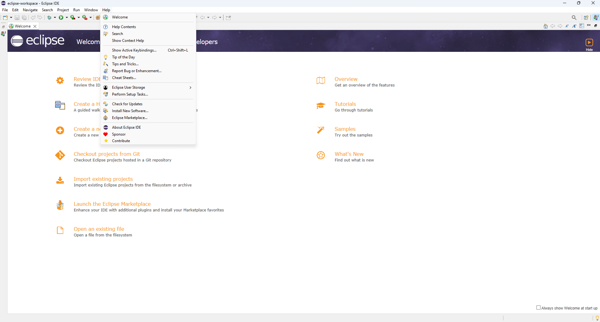

2. Nella search bar, cerca **spring boot**.
   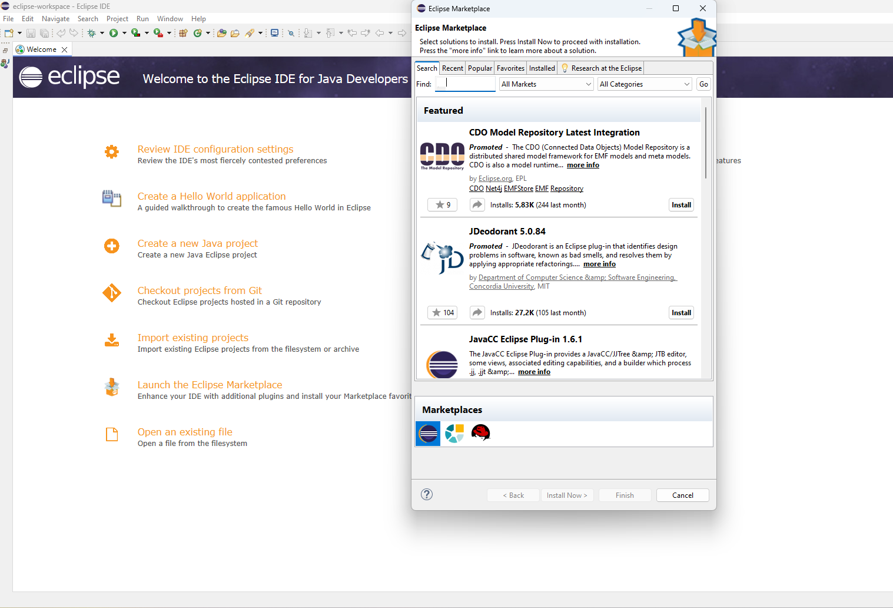

3. Seleziona la **versione 4 di Spring Boot**.
   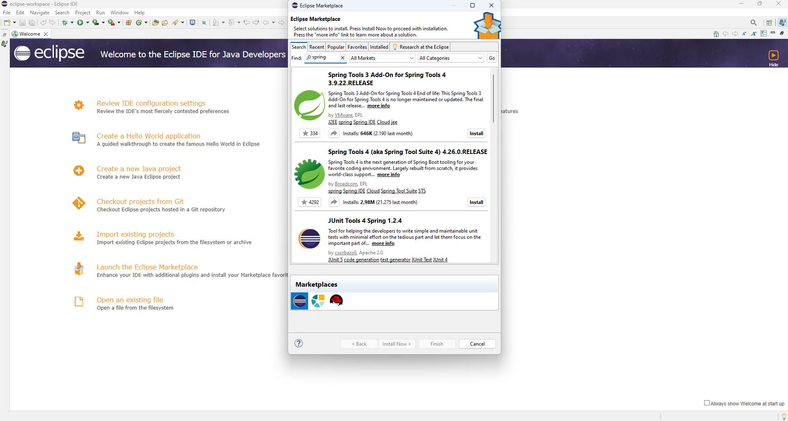

4. Installa Spring Boot e clicca su **Trust Selected**.
   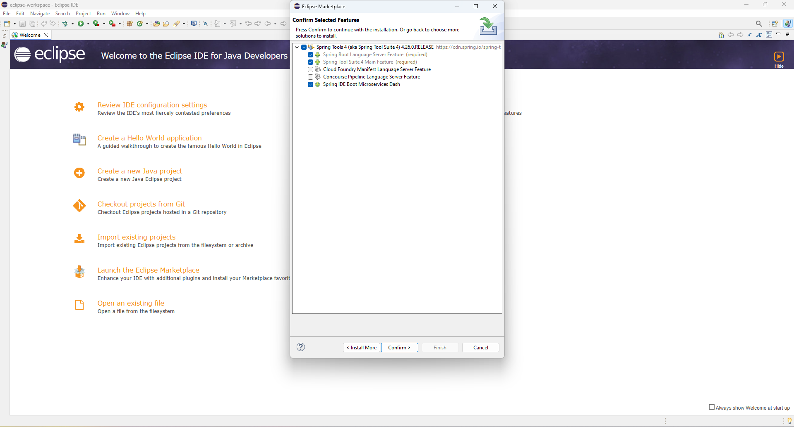

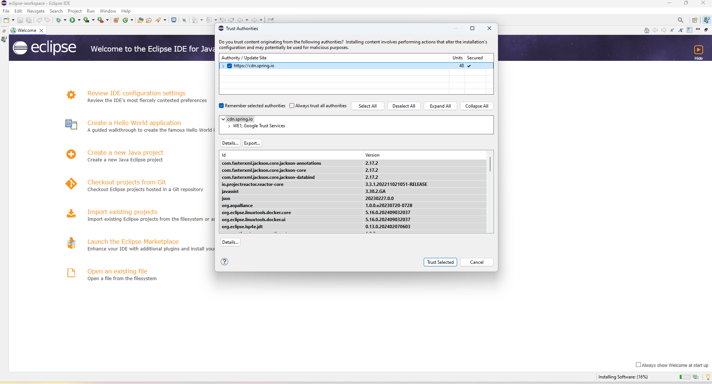
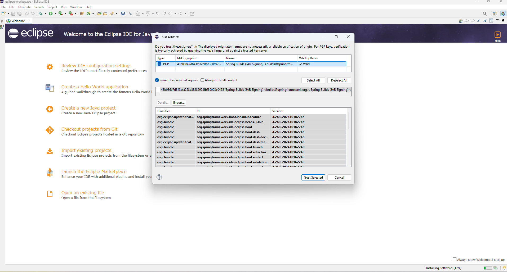

## 3. Installazione di un Server Manager

Utilizza un server manager come **XAMPP**, scaricabile da [qui](https://www.apachefriends.org/it/index.html).

## 4. Guida all'Importazione del Database su XAMPP

### Passaggi:

1. Installa XAMPP e avvia il servizio **MySQL** cliccando su **Start**.
   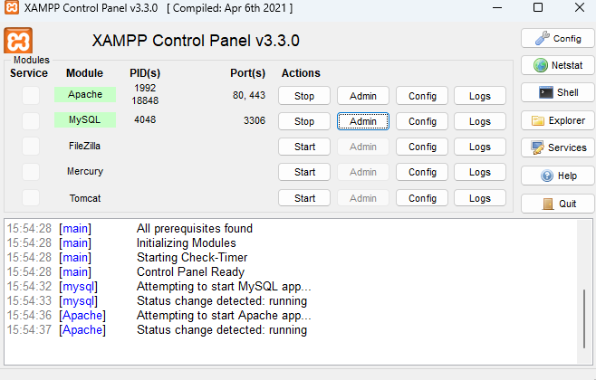

2. Clicca su **Admin**, che ti porterà alla pagina: [http://localhost/phpmyadmin/index.php](http://localhost/phpmyadmin/index.php). Qui, crea un nuovo database chiamato **lbp**, premi su di esso e poi clicca su **Importa** per caricare il file `lbp.sql` dalla cartella del progetto, mantenendo le impostazioni di default.
   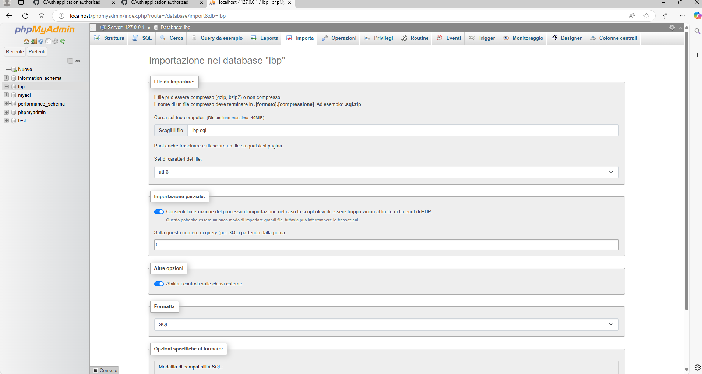

## 5. Importare il Progetto sull'IDE

### Passaggi:

1. Vai su **File** in alto a sinistra e seleziona **Importa** dal menu a tendina.
   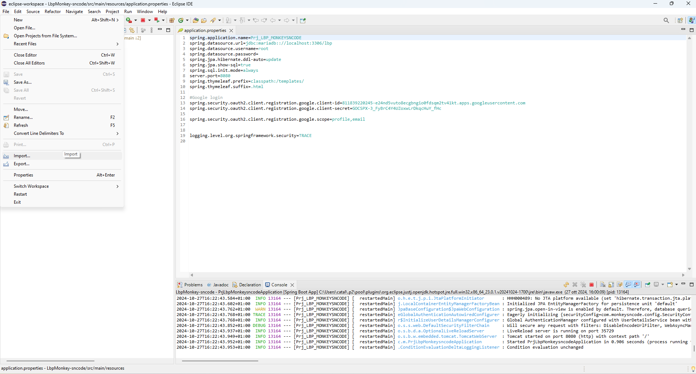

2. Scegli l'opzione **Maven esistente**.
   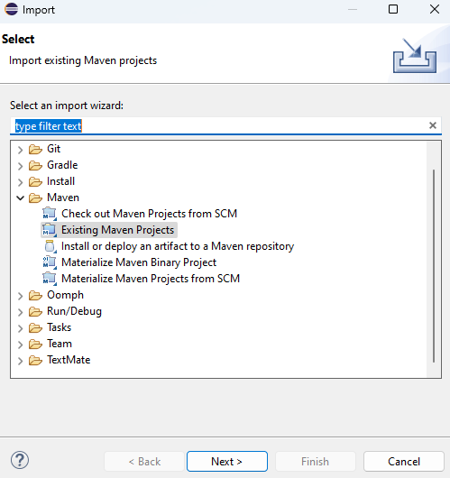

3. Seleziona la **cartella** dove si trova il progetto e clicca su **Finish**.
   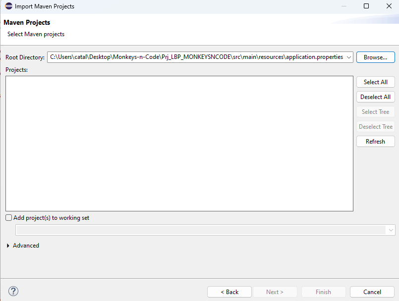

## 6. Configurazione delle Application Properties

Puoi modificare le impostazioni di connessione al database nel file `application.properties`.

### Esempio di configurazione:

```properties
# Nome dell'applicazione
spring.application.name=Prj_LBP_MONKEYSNCODE

# Configurazione del database MariaDB
spring.datasource.url=jdbc:mariadb://localhost:3306/lbp
spring.datasource.username=root
spring.datasource.password=
spring.jpa.hibernate.ddl-auto=update
spring.jpa.show-sql=true
spring.sql.init.mode=always

# Configurazione del server
server.port=8080

# Configurazione di Thymeleaf
spring.thymeleaf.prefix=classpath:/templates/
spring.thymeleaf.suffix=.html

# Configurazione Google OAuth2
spring.security.oauth2.client.registration.google.client-id=811839220245-e24nd5vuto8ecgbngio0fdsqm2tv41kt.apps.googleusercontent.com
spring.security.oauth2.client.registration.google.client-secret=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
spring.security.oauth2.client.registration.google.scope=profile,email

# Livello di logging
logging.level.org.springframework.security=TRACE
```

## 7. Dipendenze del Progetto

Ecco un elenco delle principali dipendenze utilizzate nel progetto:

1. **Spring Boot DevTools**
   ```xml
   <dependency>
       <groupId>org.springframework.boot</groupId>
       <artifactId>spring-boot-devtools</artifactId>
       <scope>runtime</scope>
       <optional>true</optional>
   </dependency>
   ```
   *Uso:* Facilita lo sviluppo locale con il caricamento automatico delle modifiche.

2. **MariaDB JDBC Driver**
   ```xml
   <dependency>
       <groupId>org.mariadb.jdbc</groupId>
       <artifactId>mariadb-java-client</artifactId>
       <scope>runtime</scope>
   </dependency>
   ```

3. **Spring Data JPA**
   ```xml
   <dependency>
       <groupId>org.springframework.boot</groupId>
       <artifactId>spring-boot-starter-data-jpa</artifactId>
   </dependency>
   ```

4. **Spring Boot Starter FreeMarker**
   ```xml
   <dependency>
       <groupId>org.springframework.boot</groupId>
       <artifactId>spring-boot-starter-freemarker</artifactId>
   </dependency>
   ```

5. **Spring Boot Starter Thymeleaf**
   ```xml
   <dependency>
       <groupId>org.springframework.boot</groupId>
       <artifactId>spring-boot-starter-thymeleaf</artifactId>
   </dependency>
   ```

6. **Spring Boot Starter OAuth2 Client**
   ```xml
   <dependency>
       <groupId>org.springframework.boot</groupId>
       <artifactId>spring-boot-starter-oauth2-client</artifactId>
   </dependency>
   ```

7. **Spring Boot Starter Web**
   ```xml
   <dependency>
       <groupId>org.springframework.boot</groupId>
       <artifactId>spring-boot-starter-web</artifactId>
   </dependency>
   ```

8. **Spring Boot Starter AOP**
   ```xml
   <dependency>
       <groupId>org.springframework.boot</groupId>
       <artifactId>spring-boot-starter-aop</artifactId>
   </dependency>
   ```

9. **Spring Boot Starter Test**
   ```xml
   <dependency>
       <groupId>org.springframework.boot</groupId>
       <artifactId>spring-boot-starter-test</artifactId>
       <scope>test</scope>
   </dependency>
   ```

10. **Spring Security Test**
    ```xml
    <dependency>
        <groupId>org.springframework.security</groupId>
        <artifactId>spring-security-test</artifactId>
        <scope>test</scope>
    </dependency>
    ```

## 8. File `pom.xml`

Il file `pom.xml` gestisce le dipendenze di Maven per l'applicazione Spring Boot e include tutte le librerie necessarie per il corretto funzionamento.

### Esempio di configurazione `pom.xml`:

```xml
<project>
    <modelVersion>4.0.0</modelVersion>
    <groupId>com.example</groupId>
    <artifactId>Prj_LBP_MONKEYSNCODE</artifactId>
    <version>0.0.1-SNAPSHOT</version>
    <packaging>jar</packaging>

    <properties>
        <java.version>17</java.version>
    </properties>

    <dependencies>
        <!-- Inserire qui le dipendenze -->
    </dependencies>
</project>
```

## 9. Esecuzione dell'Applicazione

### Passaggi per l'esecuzione:

1. **Avvio dell'applicazione**: Una volta completata la compilazione, avvia l'applicazione usando **"Run As" > Spring Boot App**. Questo avvierà l'applicazione sul server locale (porta predefinita: 8080).

2. **Verifica dell'esecuzione**: Apri il browser e naviga verso [http://localhost:8080](http://localhost:8080) per vedere l'applicazione in esecuzione. Potrebbe essere richiesta l'autenticazione tramite Google OAuth2 per accedere a determinate sezioni dell'applicazione.

---
